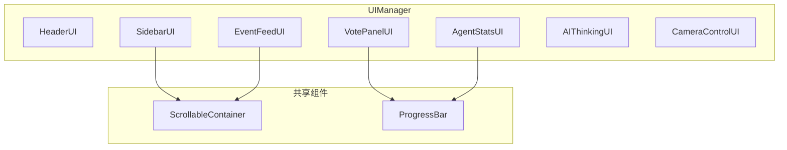

# RexUI 替换项目 UI 方案

## 一、项目现状分析

### 1.1 当前 UI 架构

项目使用 Phaser 3 构建游戏，UI 位于 `packages/web/src/game/ui/`，采用自定义 `BaseUI` 基类 + 原生 Phaser 对象（Rectangle、Text、Graphics、Container）实现：




### 1.2 UI 复杂度评估


| UI 组件           | 复杂度 | 主要功能                           | 建议                      |
| --------------- | --- | ------------------------------ | ----------------------- |
| HeaderUI        | 低   | 标题、LIVE 指示、倒计时、存活数             | 保留，用 RexUI 重构           |
| SidebarUI       | 中   | 可滚动 Agent 列表、点击选择              | 保留，用 ScrollablePanel 替换 |
| VotePanelUI     | 高   | 倒计时条、3 个投票卡、**DOM 自定义输入**、投票统计 | 简化：删除自定义输入              |
| AgentStatsUI    | 高   | 血条、护盾条、4 个统计框、联盟/敌人            | 简化：合并为 2 行或删除           |
| EventFeedUI     | 中   | 可滚动事件列表                        | 保留，用 ScrollablePanel 替换 |
| AIThinkingUI    | 高   | 可滚动思考历史、相对时间戳、推理展示             | **改为 Agent 头顶气泡**（核心）   |
| CameraControlUI | 低   | 双摄像头切换按钮                       | 保留，用 RexUI 按钮重构         |


---

## 二、RexUI 替换映射


| 现有实现                  | RexUI 替代                                | 说明                                |
| --------------------- | --------------------------------------- | --------------------------------- |
| `ScrollableContainer` | `rexUI.add.scrollablePanel`             | 内置 mask、slider、mouseWheelScroller |
| `ProgressBar`         | `rexUI.add.lineProgress`                | 进度条，支持 value 动画                   |
| 矩形背景                  | `rexUI.add.roundRectangle`              | 圆角矩形                              |
| 投票卡/按钮                | `rexUI.add.buttons` 或 `rexUI.add.label` | 可点击 Label                         |
| 切换按钮                  | `rexUI.add.toggleSwitch`                | 双摄像头开关                            |
| 文本输入                  | `rexUI.add.canvasInput`                 | 替代 DOMElement（可选）                 |
| AI 思考气泡               | `rexUI.add.simpleLabel` / `label`       | Agent 头顶对话框，圆角背景 + 文本             |


---

## 三、AIThinkingUI 头顶气泡设计（核心）

### 3.1 效果示意

```
        ┌─────────────────────────────┐
        │ Decision: Attack nearest    │
        │ Reason: Agent has low HP... │
        └──────────────▼──────────────┘
                  🤖 Agent
```

气泡跟随选中 Agent 头顶，类似 RPG 对话气泡，仅展示**最新一条**思考。

### 3.2 技术实现


| 项目  | 方案                                                                                  |
| --- | ----------------------------------------------------------------------------------- |
| 组件  | RexUI `rexUI.add.simpleLabel` 或 `rexUI.add.label`                                   |
| 背景  | `rexUI.add.roundRectangle` 圆角矩形，半透明深色                                               |
| 内容  | 最新 ThinkingProcess：`Decision: ${action}` + `Reason: ${reasoning 截断 40 字}`           |
| 定位  | 屏幕空间，每帧 `worldToScreen(agentWorldX, agentWorldY)` 得到 Agent 屏幕坐标，气泡 Y = screenY - 80 |
| 可见性 | 无选中 Agent 时隐藏；有选中且无思考时显示 "Thinking..."                                              |


### 3.3 依赖与数据流

- **CameraManager**：`worldToScreen(worldX, worldY)` 已存在
- **Agent 世界坐标**：`displayX * CELL_SIZE + CELL_SIZE/2`（需从 GameScene 或 AgentDisplayStateManager 获取）
- **思考数据**：`state:thinking:updated` → 取 `thinkingMap.get(selectedAgentId)` 最后一条

### 3.4 与 UIManager 的集成

- AIThinkingUI 需接收 `CameraManager`（用于 worldToScreen）和 `AgentDisplayStateManager`（或通过 GameScene 传入 display 坐标）
- 气泡使用 **uiCamera** 渲染（worldCamera.ignore），保证固定大小、不被世界遮挡
- UIManager 的 `isPointerOverUI` 无需包含气泡区域（气泡在游戏区内，不阻挡相机操作）

---

## 四、实施步骤

### 阶段 1：环境准备

1. **安装依赖**：`pnpm add phaser3-rex-plugins`
2. **注册 RexUI 插件**：在 [GameCanvas.tsx](packages/web/src/game/GameCanvas.tsx) 中修改 Phaser 配置，添加 `scene.plugins: [RexUIPlugin]`
3. **TypeScript 声明**：在 `packages/web/src/game/` 下添加 `phaser-rex.d.ts`，声明 `scene.rexUI: RexUIPlugin`

### 阶段 2：AIThinkingUI 改为 Agent 头顶气泡

- **重构 AIThinkingUI**：从固定底部面板改为跟随选中 Agent 的头顶气泡
- **实现方式**：用 RexUI `simpleLabel` 或 `label`（圆角矩形背景 + 文本）作为气泡
- **定位逻辑**：每帧用 `CameraManager.worldToScreen()` 将 Agent 世界坐标转为屏幕坐标，气泡放在 Agent 头顶上方（如 -80px）
- **内容**：仅展示**最新一条**思考（Decision + Reason 截断），不再滚动历史
- **依赖**：需传入 CameraManager 以做 worldToScreen；需 AgentDisplayStateManager 或 stateManager 获取选中 Agent 的 displayX/displayY

### 阶段 3：替换共享组件

- **删除 ScrollableContainer**：用 RexUI `scrollablePanel` 内联实现
- **删除 ProgressBar**：用 RexUI `lineProgress` 替代
- **保留 BaseUI**：继续作为容器基类，但内部改用 `rexUI` 创建子对象

### 阶段 4：逐个重构 UI

1. **HeaderUI**：用 `roundRectangle` 背景 + `rexUI.add.label` 或原生 Text 布局
2. **SidebarUI**：用 `scrollablePanel` + `panel.child` 为 Sizer，内部放 Agent 列表
3. **VotePanelUI**：简化：删除自定义输入、删除投票统计；保留倒计时条（lineProgress）+ 3 个投票按钮（buttons）
4. **AgentStatsUI**：简化：删除 4 个统计框、联盟/敌人；保留名称 + 血条 + 护盾条
5. **EventFeedUI**：用 `scrollablePanel` 替换 ScrollableContainer
6. **AIThinkingUI**：用 RexUI `simpleLabel` 实现头顶气泡，每帧跟随 Agent 定位
7. **CameraControlUI**：用 `rexUI.add.toggleSwitch` 或 `rexUI.add.label`（可点击）

### 阶段 5：清理与测试

- 删除 `ScrollableContainer.ts`，AIThinkingUI 不再使用
- 删除 `packages/web/src/game/ui/components/ScrollableContainer.ts` 和 `ProgressBar.ts`
- 更新 `UIManager.isPointerOverUI` 中移除的 AIThinking 区域（如有）
- 验证 `worldCamera.ignore()` 对 RexUI 对象的兼容性（RexUI 对象需加入 ignore 列表）

---

## 四、关键代码变更点

### 4.1 GameCanvas 配置

```javascript
// 需添加 plugins 配置
import RexUIPlugin from 'phaser3-rex-plugins/templates/ui/ui-plugin.js';

const game = new Phaser.Game({
  // ...
  plugins: {
    scene: [{
      key: 'rexUI',
      plugin: RexUIPlugin,
      mapping: 'rexUI'
    }]
  }
});
```

### 4.2 ScrollablePanel 替换 ScrollableContainer 示例

```javascript
// 原：new ScrollableContainer(scene, x, y, w, h, worldCamera)
// 新：scene.rexUI.add.scrollablePanel({
//   x, y, width: w, height: h,
//   panel: { child: contentSizer, mask: {} },
//   slider: false,  // 或配置 track/thumb
//   mouseWheelScroller: { focus: true, speed: 0.1 },
//   background: scene.rexUI.add.roundRectangle(0,0,w,h,8,0x1a1a2e)
// })
```

### 4.3 LineProgress 替换 ProgressBar

```javascript
// 原：new ProgressBar(scene, { x, y, width, height, value: 0.5 })
// 新：scene.rexUI.add.lineProgress(x, y, width, height, 0x00ff00, 0.5)
```

---

## 五、风险与注意事项

1. **RexUI 与 worldCamera.ignore**：RexUI 创建的 GameObject 需手动加入 `worldCamera.ignore()`，否则会随世界缩放/平移
2. **坐标系统**：RexUI 使用 origin 配置，需与现有 `-width/2` 等中心对齐逻辑保持一致
3. **VotePanelUI 自定义输入**：若删除，需确认后端是否依赖自定义 action；若保留，可尝试 `rexUI.add.canvasInput` 替代 DOMElement（避免 willRender 问题）
4. **双摄像头**：GameScene 中 uiCamera 与 worldCamera 分离，RexUI 对象应添加到 uiCamera 可见层，避免被 worldCamera 影响

---

## 六、文件变更清单


| 操作  | 文件                                                           |
| --- | ------------------------------------------------------------ |
| 修改  | `packages/web/package.json`（添加依赖）                            |
| 修改  | `packages/web/src/game/GameCanvas.tsx`（注册 RexUI）             |
| 新增  | `packages/web/src/game/phaser-rex.d.ts`                      |
| 修改  | `packages/web/src/game/ui/AIThinkingUI.ts`（改为头顶气泡）           |
| 删除  | `packages/web/src/game/ui/components/ScrollableContainer.ts` |
| 删除  | `packages/web/src/game/ui/components/ProgressBar.ts`         |
| 修改  | `packages/web/src/game/managers/UIManager.ts`                |
| 修改  | `packages/web/src/game/ui/HeaderUI.ts`                       |
| 修改  | `packages/web/src/game/ui/SidebarUI.ts`                      |
| 修改  | `packages/web/src/game/ui/VotePanelUI.ts`                    |
| 修改  | `packages/web/src/game/ui/AgentStatsUI.ts`                   |
| 修改  | `packages/web/src/game/ui/EventFeedUI.ts`                    |
| 修改  | `packages/web/src/game/ui/CameraControlUI.ts`                |


---

## 七、可选后续优化

- 使用 RexUI `Sizer` 统一布局，替代手算位置
- 使用 `rexUI.add.simpleLabel` 快速创建带背景的文本标签
- 若需展示多条思考历史，可在气泡内用 `rexUI.add.scrollablePanel` 做迷你滚动区

