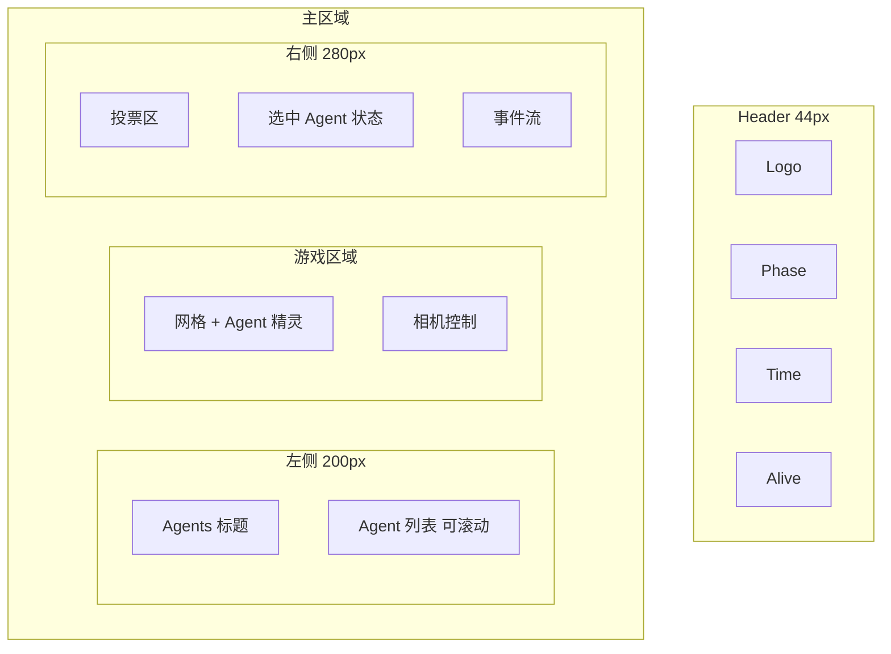

# AI Battle Royale 游戏 UI 优化方案

## 一、现状问题分析

### 1.1 布局与信息层级

- **Agent 列表**：位于左侧 Sidebar（约 180px 宽），无标题，用户难以理解该区域用途
- **游戏主区域**：中央大片区域显示网格和 Agent 精灵，但缺少与左侧列表的视觉关联
- **右侧面板**：VotePanel、AgentStats、EventFeed 垂直堆叠，信息密度高且层级不清

### 1.2 颜色混乱

当前各 UI 组件颜色分散、缺乏统一语义：

| 组件        | 当前颜色    | 问题           |
| --------- | ------- | ------------ |
| Header 标题 | #00ffff | 与 LIVE、按钮等混用 |
| LIVE 指示   | #ff0000 | 独立红色         |
| 倒计时/数字    | #ffff00 | 黄色与绿色混用      |
| 存活数       | #00ff00 | 绿色           |
| Vote 按钮   | #00ffff | 与标题同色        |
| Agent 选中  | #00ffff | 无主次区分        |

### 1.3 触摸板/点击不友好

- **Sidebar 列表项**：高度 36px（[SidebarUI.ts:129](packages/web/src/game/ui/SidebarUI.ts)），低于 WCAG 建议 44px
- **Vote 卡片**：40px 高（[VotePanelUI.ts:87](packages/web/src/game/ui/VotePanelUI.ts)）
- **Camera 按钮**：32px 高（[CameraControlUI.ts](packages/web/src/game/ui/CameraControlUI.ts)）
- **EventFeed 条目**：无明确可点击区域，滚动依赖滚轮

### 1.4 Agent 定位困难

- 左侧列表与中央游戏世界无直观关联
- 选中 Agent 后，主相机不自动跟随，用户需手动寻找
- 无「聚焦到选中 Agent」的快捷操作

### 1.5 缺乏响应式

- **游戏**：画布使用 RESIZE 会随窗口变化，但 CameraManager 的 fitZoom、PiP 视口在 resize 后未重算
- **UI**：布局仅在 create 时按比例计算一次，窗口 resize 后 UI 位置/尺寸不更新，导致错位或溢出

---

## 二、设计系统（Design System）——与落地页对齐

设计语言与 [landing-globals.css](packages/web/src/styles/landing-globals.css) 完全一致，确保品牌统一。

### 2.1 颜色规范（从落地页 CSS 变量抽取）

| 语义               | CSS 变量             | HSL          | Hex（Phaser 用） |
| ---------------- | ------------------ | ------------ | ------------- |
| Primary          | --primary          | 195 100% 50% | 0x00D4FF      |
| Accent           | --accent           | 25 100% 50%  | 0xFF8000      |
| Background       | --background       | 222 47% 5%   | 0x070A12      |
| Card             | --card             | 222 47% 7%   | 0x0A0F1A      |
| Secondary        | --secondary        | 222 30% 14%  | 0x1A1F2E      |
| Muted            | --muted            | 222 30% 12%  | 0x151922      |
| Muted-foreground | --muted-foreground | 210 20% 55%  | 0x6B7A8F      |
| Destructive      | --destructive      | 0 84% 60%    | 0xE54F4F      |
| Border           | --border           | 222 30% 18%  | 0x212938      |
| Arena-dark       | --arena-dark       | 222 47% 3%   | 0x050810      |

**语义映射**：标题/主按钮用 Primary；LIVE/存活/HP 满用 Primary 或 Accent；死亡/危险用 Destructive；次要文本用 Muted-foreground；面板背景用 Card/Secondary。

### 2.2 字体规范（与落地页一致）

- **标签/按钮**：font-mono，uppercase，tracking-wider（对应 Arial 或可加载 Geist Mono 字体）
- **标题**：14–16px bold，Primary
- **正文**：12–13px，Muted-foreground
- **数字/状态**：13–14px bold，按语义着色

### 2.3 UI 图标（精灵图）

- **来源**：落地页使用的 Lucide 图标（Zap、Users、Activity、TrendingUp 等）导出为 PNG
- **规格**：建议 24x24 或 32x32，透明底，主色/强调色描边或填充
- **用途**：Header 状态、VotePanel 统计、EventFeed 事件类型等
- **游戏内 Agent 精灵**：保持现有 Warrior 资源，不参考落地页

### 2.4 间距与圆角

- 内边距：12px（小）、16px（中）
- 圆角：8px（与 --radius: 0.5rem 一致）
- 触摸目标：最小 44x44px

---

## 三、响应式设计（游戏与 UI）

遵循常见游戏响应式模式：画布随窗口缩放，游戏相机与 UI 同步重算布局，小屏采用适配策略。

### 3.1 游戏画布

- **当前**：`Phaser.Scale.RESIZE`，画布随 `window.innerWidth/Height` 变化，`scene.scale` 会派发 `resize` 事件
- **保持**：继续使用 RESIZE，确保全屏填充
- **CameraManager**：监听 `scene.scale.on('resize')`，在回调中重算 `fitZoom`、`minZoom`、`centerCamera`，并更新 PiP 相机 viewport 与位置

### 3.2 UI 布局响应

- **UIManager**：监听 `scene.scale.on('resize', this.onResize, this)`，在 `onResize` 中：
  - 从 `scene.scale.width`、`scene.scale.height` 获取新尺寸
  - 按比例或断点重算 `sidebarWidth`、`headerHeight`、`rightPanelWidth`
  - 遍历各 UI 组件调用 `resize(newWidth, newHeight)` 重定位
- **BaseUI**：新增 `resize(width: number, height: number): void` 抽象方法，默认实现 `setPosition` + `setSize`
- **各 UI 组件**：实现 `resize()`，根据新尺寸更新 container 位置、scrollablePanel 宽高、内部元素布局

### 3.3 断点策略（可选）

| 断点  | 宽度         | 策略                                |
| --- | ---------- | --------------------------------- |
| 小屏  | < 768px    | Sidebar 缩至 160px 或可折叠；右侧面板缩窄；字体略减 |
| 中屏  | 768–1280px | 当前比例布局                            |
| 大屏  | > 1280px   | 当前比例布局，面板最大宽度可设上限                 |

### 3.4 触摸目标与字体

- 触摸目标保持 ≥ 44px，小屏不缩小
- 字体可按 `Math.min(baseSize, canvasHeight * 0.02)` 等比例缩放，避免过大或过小

---

## 四、布局优化

### 4.1 目标布局示意

### 4.2 具体调整

1. **Sidebar**
  - 增加「Agents」标题，明确区域用途
  - 列表项高度从 36px 增至 48px
  - 选中项增加左侧色条 + 背景高亮，便于识别
2. **游戏区域**
  - 在 Camera 按钮旁增加「聚焦选中 Agent」按钮
  - 选中 Agent 时，主相机平滑移动到该 Agent 位置（可选，由用户配置）
3. **右侧面板**
  - VotePanel 与 AgentStats 之间增加分隔线
  - AgentStats 在无选中时显示「点击左侧 Agent 选择」提示

---

## 五、交互与动效

### 5.1 触摸目标扩大

| 元素              | 当前     | 目标           |
| --------------- | ------ | ------------ |
| Sidebar Agent 项 | 36px 高 | 48px 高，整行可点击 |
| Vote 卡片         | 40px 高 | 48px 高       |
| Camera 按钮       | 32px 高 | 40px 高       |
| 新增「聚焦」按钮        | -      | 40x40px      |

### 5.2 即时反馈

- **Hover**：所有可点击元素 hover 时背景色加深（如 0.1 alpha 叠加）
- **Click**：点击时短暂 scale(0.98) 或 alpha 闪烁
- **选中 Agent**：列表项左侧 4px 色条 + 背景色变化

### 5.3 动效（与落地页一致）

- **LIVE 呼吸**：保留现有实现，与落地页 pulse-neon 一致
- **主按钮/标题**：可选用 Phaser 的 postFX glow 或 alpha 脉冲，模拟落地页 glow-expand
- **血条/护盾条**：value 变化用 tween 平滑过渡
- **新事件**：EventFeed 新条目淡入 + 轻微上滑

---

## 六、实施步骤

### 阶段 1：设计系统落地

1. 新建 `packages/web/src/game/ui/theme.ts`，从 landing-globals.css 的 CSS 变量抽取，导出 hex 颜色、字体、间距常量
2. 各 UI 组件引用 theme，替换硬编码颜色
3. **UI 图标**：将 Lucide 图标（Zap、Users、Activity、TrendingUp 等）导出为 PNG，放入 `public/assets/ui/`，在 GameCanvas 或 GameScene 的 preload 中加载；若暂不导出，可先用 Phaser Graphics 绘制圆点/线条保持风格

### 阶段 2：布局与 Agent 可见性

1. **UIManager**：调整 sidebarWidth 至 200px，确保 Sidebar 有足够空间
2. **SidebarUI**：增加「Agents」标题；列表项高度 48px；扩大 hitArea
3. **CameraManager**：新增 `focusOnAgent(agentId)` 方法，主相机平滑移动到该 Agent
4. **CameraControlUI**：增加「聚焦选中 Agent」按钮（仅选中时显示）

### 阶段 2.5：响应式（游戏与 UI）

1. **UIManager**：在 create 后注册 `this.scene.scale.on('resize', this.onResize, this)`，在 `onResize` 中：
  - 更新 `canvasWidth`、`canvasHeight`、`sidebarWidth`、`headerHeight`、`rightPanelWidth`（按比例或断点）
  - 遍历各 UI 组件调用 `resize(newWidth, newHeight)` 或 `setPosition` + `setSize`
  - 更新 `isPointerOverUI` 使用的边界
2. **BaseUI**：新增 `resize(width: number, height: number): void` 抽象方法，默认实现 `setPosition` + `setSize`
3. **各 UI 组件**：实现或继承 `resize()`，根据新尺寸更新 container 位置、scrollablePanel 宽高、内部元素布局
4. **CameraManager**：新增 `onResize()` 或监听 scene.scale.resize，重算 `fitZoom`、`minZoom`、`centerCamera`，并更新 PiP 相机 viewport 与位置

### 阶段 3：触摸目标与反馈

1. **SidebarUI**：`createAgentItem` 中 bg 高度改为 48px，`setInteractive` 覆盖整行
2. **VotePanelUI**：cardHeight 改为 48px
3. **CameraControlUI**：buttonHeight 改为 40px
4. **BaseUI** 或各组件：为可点击元素统一添加 hover/click 反馈（背景色、scale）

### 阶段 4：动效与一致性

1. 血条/护盾条：使用 tween 平滑过渡 value
2. EventFeed：新条目淡入动画

---

## 七、关键文件变更

| 操作  | 文件                                                                  | 说明                                       |
| --- | ------------------------------------------------------------------- | ---------------------------------------- |
| 新增  | `packages/web/src/game/ui/theme.ts`                                 | 从落地页抽取颜色（hex）、字体、间距                      |
| 新增  | `public/assets/ui/*.png`                                            | 可选：Lucide 图标导出 PNG（Zap、Users、Activity 等） |
| 修改  | [UIManager.ts](packages/web/src/game/managers/UIManager.ts)         | 布局尺寸、resize 监听与重算                        |
| 修改  | [SidebarUI.ts](packages/web/src/game/ui/SidebarUI.ts)               | 标题、列表项高度、theme、resize                    |
| 修改  | [HeaderUI.ts](packages/web/src/game/ui/HeaderUI.ts)                 | theme、resize                             |
| 修改  | [VotePanelUI.ts](packages/web/src/game/ui/VotePanelUI.ts)           | 卡片高度、theme、反馈、resize                     |
| 修改  | [AgentStatsUI.ts](packages/web/src/game/ui/AgentStatsUI.ts)         | theme、无选中提示、resize                       |
| 修改  | [EventFeedUI.ts](packages/web/src/game/ui/EventFeedUI.ts)           | theme、新条目动效、resize                       |
| 修改  | [CameraControlUI.ts](packages/web/src/game/ui/CameraControlUI.ts)   | 按钮尺寸、聚焦按钮、resize                         |
| 修改  | [CameraManager.ts](packages/web/src/game/managers/CameraManager.ts) | focusOnAgent、resize 时重算 fitZoom/PiP 视口   |
| 修改  | [BaseUI.ts](packages/web/src/game/ui/BaseUI.ts)                     | 新增 resize(w, h) 抽象方法                     |
| 修改  | [AIThinkingUI.ts](packages/web/src/game/ui/AIThinkingUI.ts)         | theme、resize（气泡定位依赖画布尺寸）                 |

